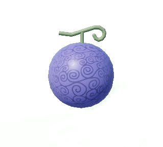

# Gum-Gum (Gomu-Gomu no Mi)

# Preview

# Info

Type: Paramecia*

# Movelist

| Requirements | Move Name                           |
|--------------|-------------------------------------|
| 10 Melee     | [Gum-Gum Pistol](./gum/pistol.md)   |
| 20 Melee     | [Gum-Gum Rocket](./gum/rocket.md)   |
| 30 Melee     | [Gum-Gum Balloon](./gum/balloon.md) |
| 40 Melee     | [Gum-Gum Bazooka](./gum/bazooka.md) |
| 50 Melee     | [Gum-Gum Gatling](./gum/gatling.md) |

# Pros

The user of this fruit is bestowed the properties of "Rubber" making him a rubber human.
Physical blunt attacks along with bullets do not damage users with this fruit.

Has a decent amount of range due to the elasticity of the fruit, and can be a deadly combination when
mixed with Buso.

# Cons

Can be easily sliced with sword and other sharp related abilities.

No passive logia effect due to it being a Paramecia.

